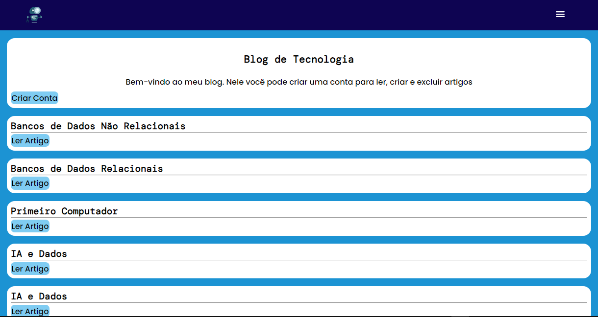

# Blog made with React and Node.js
  
 
 .
 ### Demo app: https://nk-blog-project.netlify.app
# About
 This project is a blog that let users create, delete, update and read articles.
 For the web page I used React and the API was made using Node.js.
 The authentication occurs on the middleware, using JWT Token and LocalStorage.
 The API makes the communication between the web page and the database that stores all the data.
 If you want to add or remove an item on the site, please, use moderately.

# Used Tecnologies
 ### Back-end
 - JavaScript
 - Node.js
 - Express
 - Sequelize
 - MySQL
 - Bcrypt
 - JWT
 - CORS

 ### Front-end
 - React
 - JavaScript
 - Axios
 - JSX
 - CSS

 ### Implantation
 - Website: https://nk-blog-project.netlify.app
 - API: https://blog-project-0gqp.onrender.com (check project for routes)

# Author
 Nicolas Klein Faria de Araujo  
 https://nk-portfolio-react.netlify.app
